# Eindproject-API

**Gemaakt door:** Mehmet Demirtas  
**Studentnummer:** r0939369

## Over het thema

Dit is mijn API project over snacks en soda. Ik sla al de gegevens ook op in mijn database met sqlite.

#### POST requests

- **Post-request snack**: Hier kan je de naam en extra informatie van de snack geven (automatisch ID toegevoegd).
- **Post-request soda**: Hier kan je de naam en de smaak van de soda geven (automatisch ID toegevoegd).

#### GET requests

- **Get-request snack**: hier kan je de id van de snack geven en krijg je de informatie van dat snack binnen.
- **Get-request all snack**: Hier kan je de van/tot id ingeven dat je wil zien over de snack's.
- **Get-request soda**: hier kan je de id van de soda geven en krijg je de informatie van dat soda binnen.
- **Get-request team/soda**: Hier kan je de van/tot id ingeven dat je wil zien over de soda's.

#### DELETE requests

- **Delete-request snack/soda**: Hier kan je de snack/soda verwijderen door de ID te geven.

### Overview API

- [API-documentatie](img/docs.png)

### Postman Screenshots

- Post-request: add snack 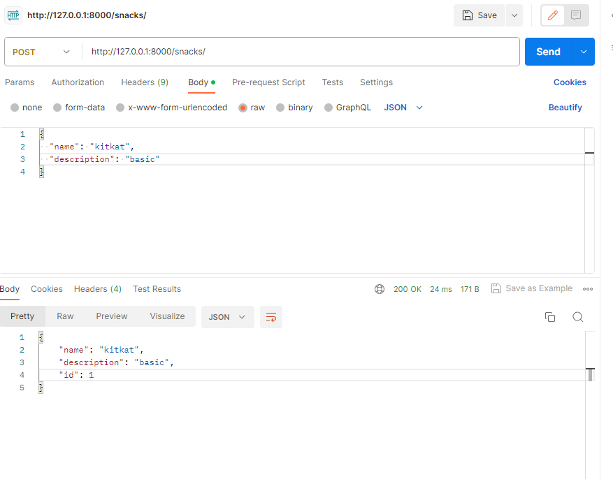
- Post-request: add sodas 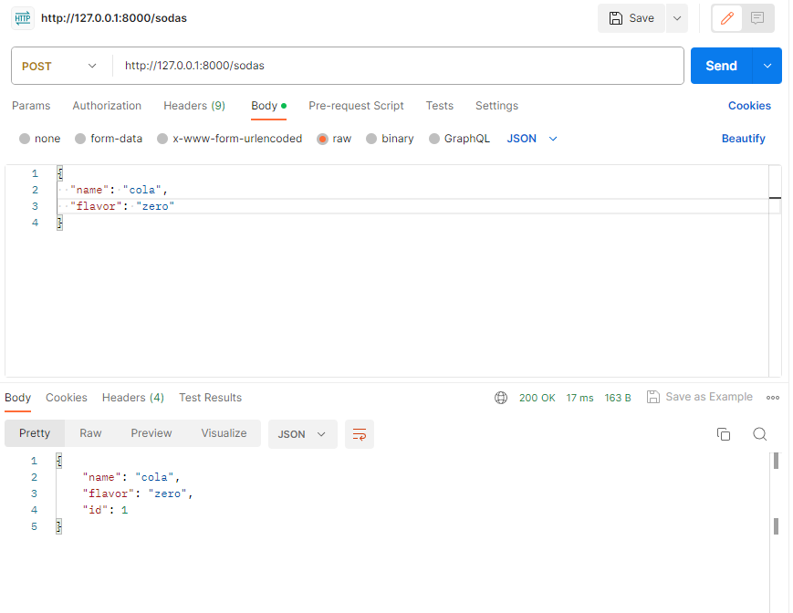
- Get-request: all snack 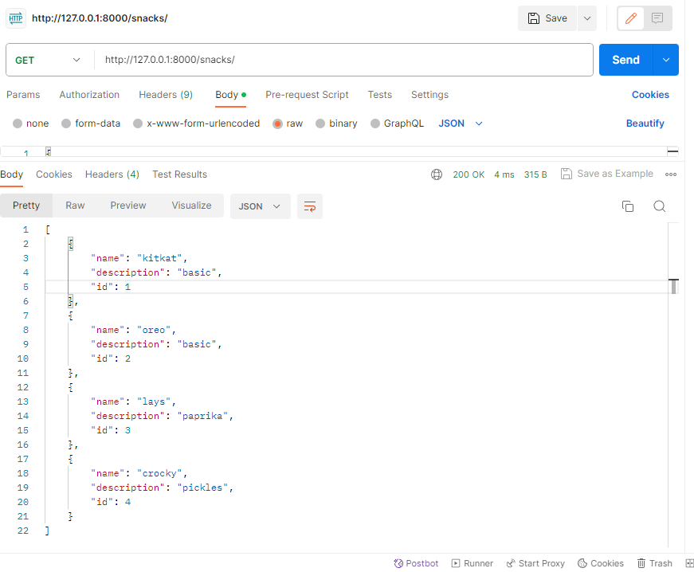
- Get-request: all soda 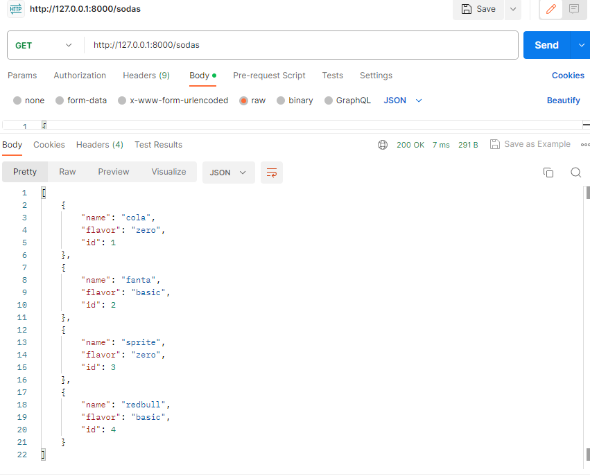
- Get-request: id snack 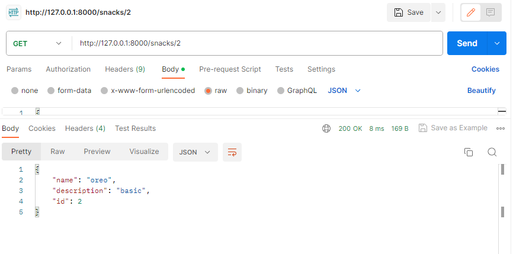
- Get-request: id soda 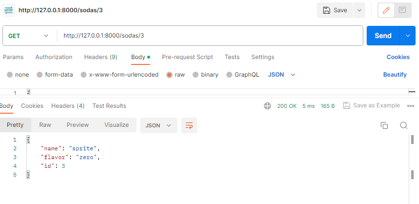
- Delete-request: remove snack id 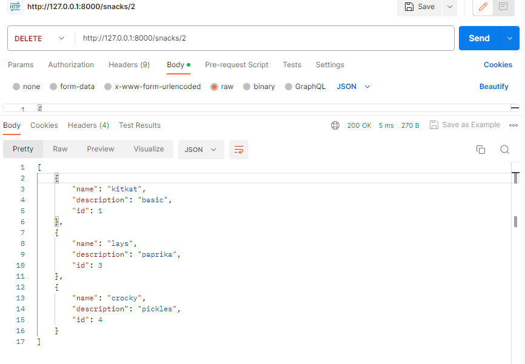
- Delete-request: remove soda id 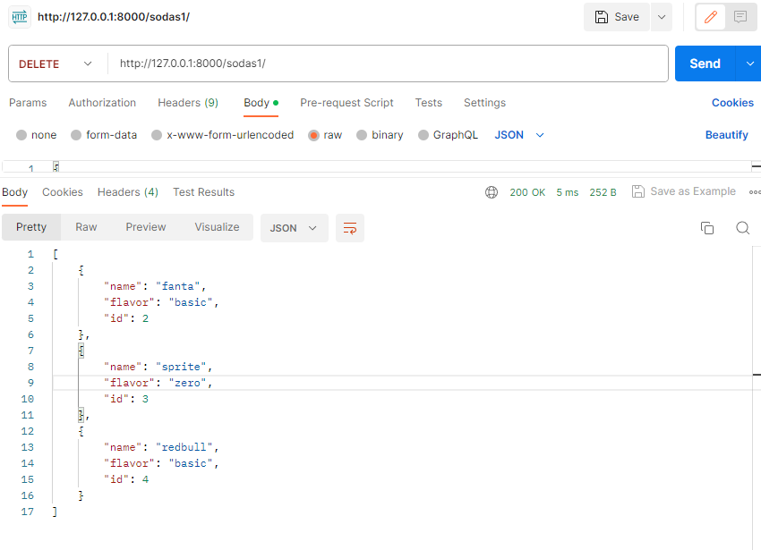

### OPENAPI Screenshots

- Post-request: add snack 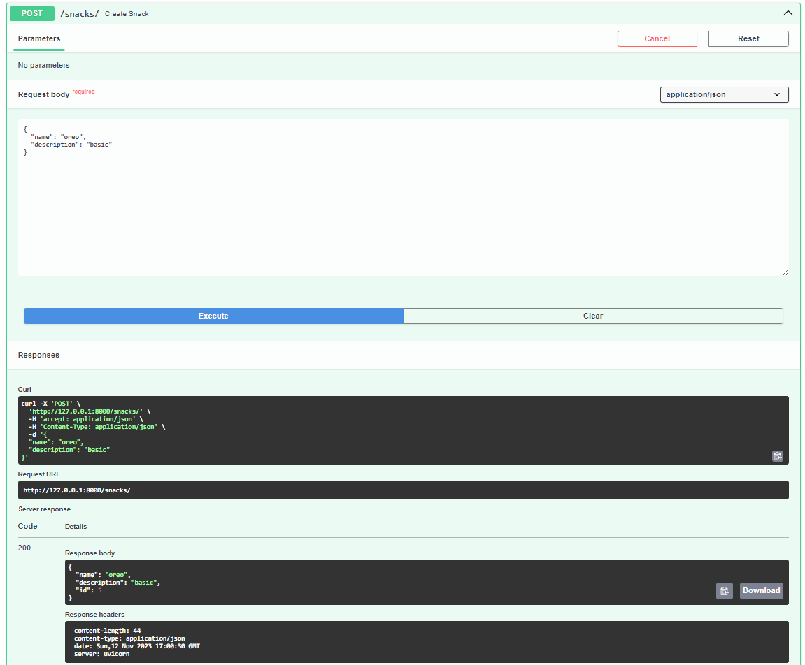
- Post-request: add sodas 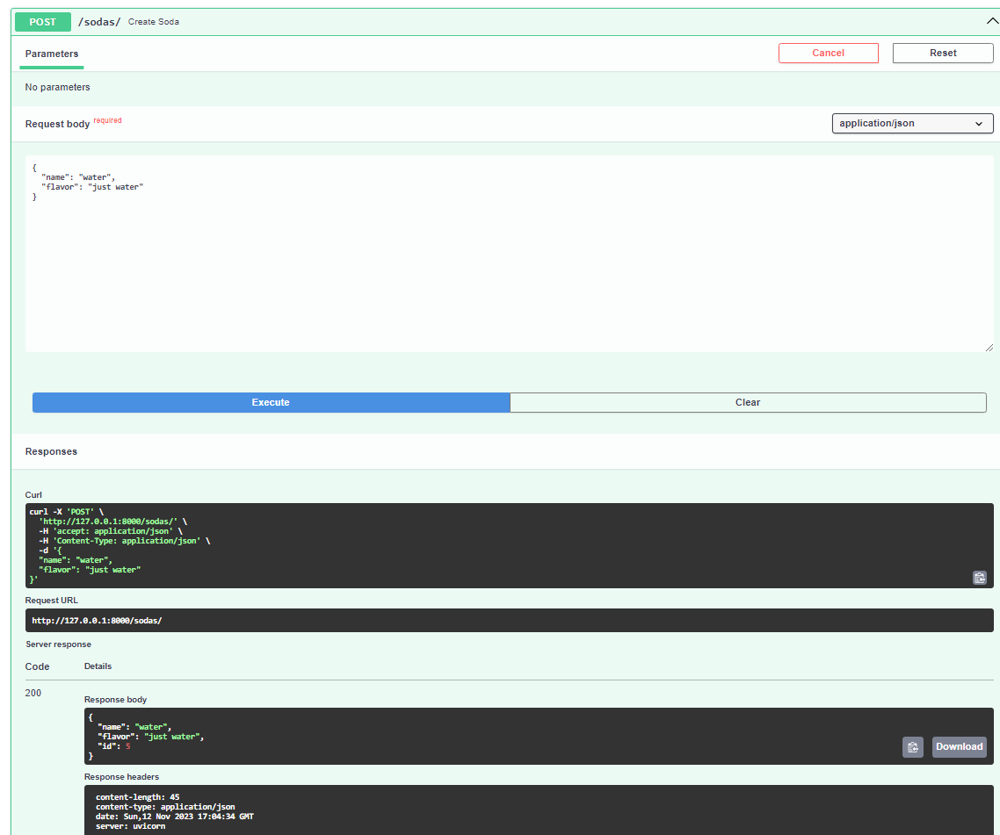
- Get-request: all snack 
- Get-request: all soda 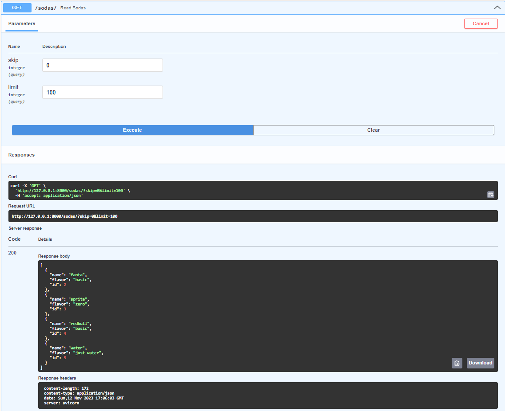
- Get-request: id snack 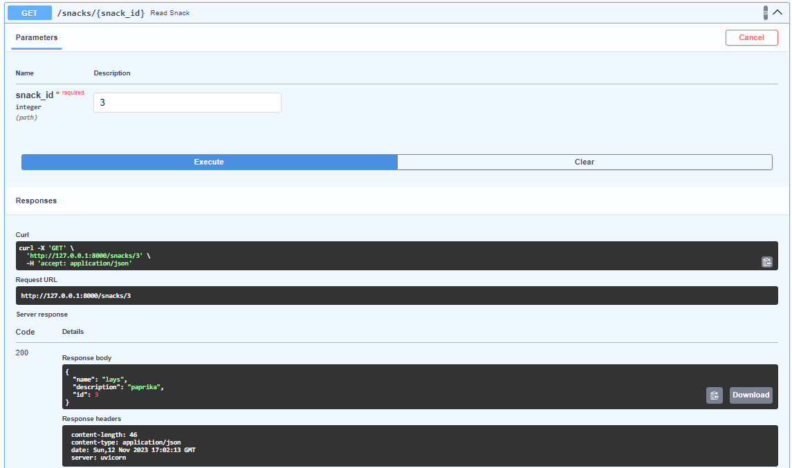
- Get-request: id soda 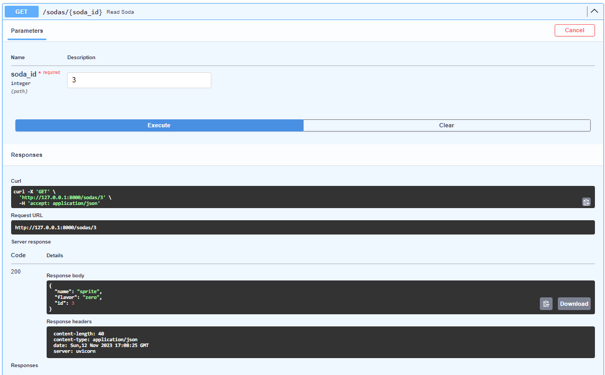
- Delete-request: remove snack id (it shows error but it gets removed from the database) 
- Delete-request: remove soda id (it shows error but it gets removed from the database) 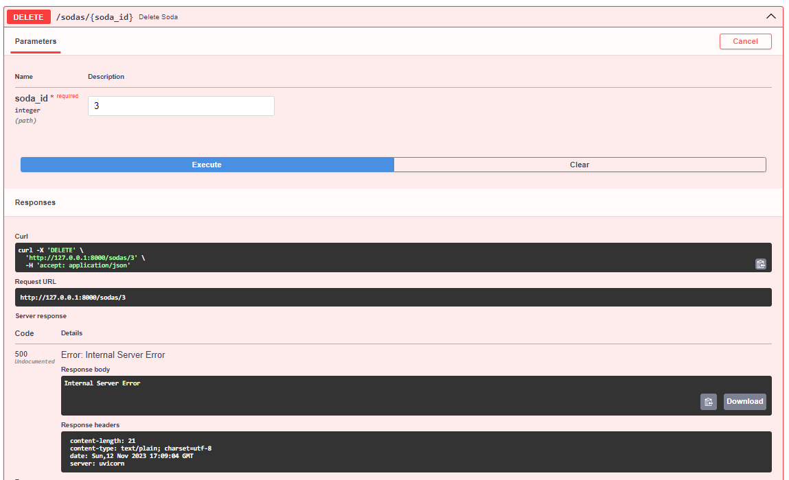

---